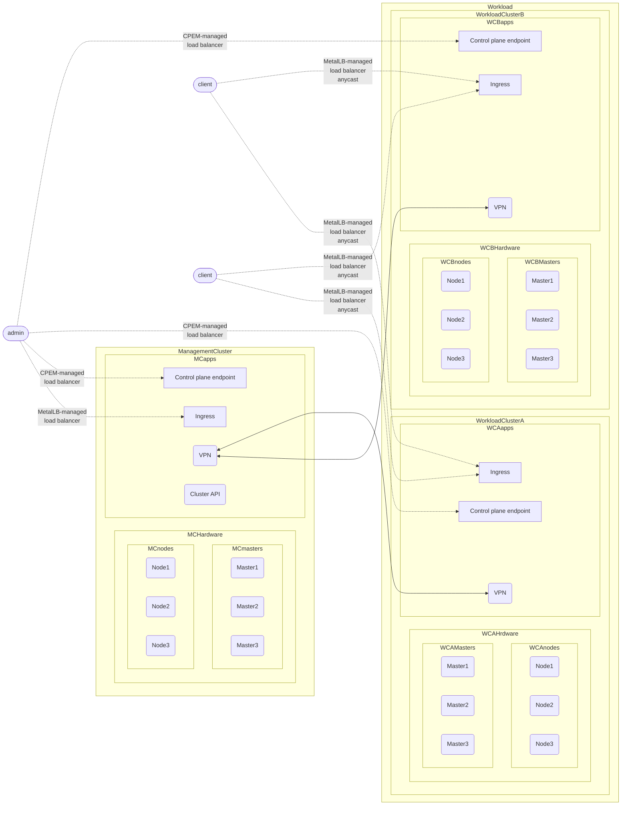

# Talos on Equinix Metal with Cluster API

Following project in an attempt to formulate the best practices for running
[Talos Linux](https://www.talos.dev/) on [Equinix Metal](https://deploy.equinix.com/metal/),
via [Kubernetes Cluster API](https://cluster-api.sigs.k8s.io/).

The goal is to run a setup with one management cluster, and two workload clusters. The management cluster will have the
Cluster API installed. We will have load balancing with anycast for the workload clusters.
Load balancing on cluster endpoints and full cilium mesh, between the clusters.



- [user setup](#user-setup)
- [development setup](#developer-setup)
- [benchmark](#benchmark)
- [static config](#static-config)
- [todo](#todo)

Consider [talos-alloy-102-static-config-redacted.yaml](./talos-alloy-102-static-config-redacted.yaml) an example of generated manifest

## user setup
### user prerequisites

- An account on [Equinix Metal](https://deploy.equinix.com/metal/)
- [zsh env](https://github.com/ohmyzsh/ohmyzsh/tree/master/plugins/dotenv) plugin or equivalent
- [colima](https://github.com/abiosoft/colima) for MacOS users
- [gfind](https://formulae.brew.sh/formula/findutils) for MacOS users, or just GNU find for everyone else
- [kconf](https://github.com/particledecay/kconf)
- [kind](https://kind.sigs.k8s.io/)
- [kubectl](https://kubernetes.io/docs/tasks/tools/)
- [clusterctl](https://cluster-api.sigs.k8s.io/clusterctl/overview.html)
- [Metal CLI](https://github.com/equinix/metal-cli/#installation)
- [talosctl](https://github.com/siderolabs/talos)


### setup
- Create a python [virtual environment](https://docs.python.org/3/library/venv.html) 
  ```shell
  python -m venv
  ```
  With [dotenv](https://github.com/ohmyzsh/ohmyzsh/tree/master/plugins/dotenv) the python venv should be automatically activated.  
  Install python resources:
  ```shell
  pip install -r resources.txt
  ```
- Examine and adjust [.env](.env). Create `secrets/metal` and populate with required `ENV`.
- Create a temporary local cluster, this setup uses [kind](https://kind.sigs.k8s.io/), If you are running on Mac, make sure to use
  [colima](https://github.com/abiosoft/colima). At the time of writing, this setup did not work on Docker Desktop.
  In the context of the `kind` cluster mix [CABPT](https://github.com/siderolabs/cluster-api-bootstrap-provider-talos), [CACPPT](https://github.com/siderolabs/cluster-api-control-plane-provider-talos), [CAPP](https://github.com/kubernetes-sigs/cluster-api-provider-packet):
  ```sh
  invoke kind-clusterctl-init
  ```
- Register a VIP to be used by Talos as the control plane endpoint. This is a workaround for the [issue with
  CPEM EIP management](https://github.com/KrystianMarek/talos-on-equinix-metal/issues/5). Generate cluster manifest with:
  ```shell
  invoke build_manifests
  ```
- Apply the cluster manifest  
  ```sh
  kubectl apply -f "secrets/${CLUSTER_NAME}.static-config.yaml"
  ```
- Wait for the cluster to come up
  ```shell
  watch clusterctl describe cluster "${CLUSTER_NAME}"
  ```
- Get the kubeconfig of the newly created cluster tin interact with the cluster
  ```sh
  invoke get-cluster-secrets
  ```
- One can use [kconf](https://github.com/particledecay/kconf) to merge the kubeconfig
  ```sh
  kconf add "secrets/${CLUSTER_NAME}.kubeconfig"
  ```
## developer setup
### developer prerequisites
On top of [user prerequisites](#user-prerequisites)
- [tilt](https://tilt.dev/)

### setup
- Make sure you have all the submodules
- Create the tilt-settings.json file in the cluster-api folder.
  ```sh
  touch cluster-api/tilt-settings.json 
  ```
- Copy the following into that file, updating the <> sections with relevant info:
  ```json
  {
      "default_registry": "ghcr.io/<your github username>",
      "provider_repos": ["../cluster-api-provider-packet", "../cluster-api-bootstrap-provider-talos", "../cluster-api-control-plane-provider-talos"],
      "enable_providers": ["packet","talos-bootstrap","talos-control-plane"],
      "kustomize_substitutions": {
          "PACKET_API_KEY": "<API_KEY>",
          "PROJECT_ID": "<PROJECT_ID>",
          "EXP_CLUSTER_RESOURCE_SET": "true",
          "EXP_MACHINE_POOL": "true",
          "CLUSTER_TOPOLOGY": "true"
      }
  }
  ```
- Create a temporary kind cluster, with cluster-api. Navigate to the cluster-api directory
  ```sh
  make tilt-up
  ```
- In another terminal continue with [user setup](#user-setup). The purpose of `generate_cluster_manifests.sh` is to generate
  cluster manifest, Talos linux configuration, sync and validate generated configuration files. Ensuring that the 
  configuration used in [benchmark](#benchmark) is the same as in case of [user setup](#user-setup) and [development setup](#developer-setup).
  - For additional instructions consider:
    - [Cluster Management API provider for Packet](https://github.com/kubernetes-sigs/cluster-api-provider-packet)
    - [Kubernetes Cloud Provider for Equinix Metal](https://github.com/equinix/cloud-provider-equinix-metal)
    - [Collection of templates for CAPI + Talos](https://github.com/siderolabs/cluster-api-templates) 
    - [Control plane provider for CAPI + Talos](https://github.com/siderolabs/cluster-api-control-plane-provider-talos)
    - [Cluster-api bootstrap provider for deploying Talos clusters.](https://github.com/siderolabs/cluster-api-bootstrap-provider-talos)

## benchmark
Using [talosctl](https://github.com/siderolabs/talos) and [Metal CLI](https://github.com/equinix/metal-cli/#installation) as described in the [official guide](https://www.talos.dev/v1.3/talos-guides/install/bare-metal-platforms/equinix-metal/).
With Talos control plane and worker configuration the same as in case of CAPI deployment.
- Register a VIP to be used by Talos as the control plane endpoint. This is a workaround for the current issue with
  CPEM EIP management. Generate cluster manifest with:
  ```shell
  invoke build_manifests
  ```
- Create the control plane node
  ```shell
  metal device create \
    --project-id $PROJECT_ID \
    --facility $FACILITY \
    --operating-system "talos_v1" \
    --plan $PLAN\
    --hostname toem-test-cp-1\
    --userdata-file secrets/controlplane-capi.yaml
  ```
- Create the worker node
  ```shell
  metal device create \
    --project-id $PROJECT_ID \
    --facility $FACILITY \
    --operating-system "talos_v1" \
    --plan $PLAN\
    --hostname toem-test-wo-1\
    --userdata-file secrets/worker-capi.yaml
  ```
- Observe the nodes coming up
  ```shell
  watch metal device get
  ```
- Get the device list
  ```shell
  metal device get -o yaml > secrets/device-list.yaml
  ```
- Find the control plane node IP address
  ```shell
  export config_plane_ip=$(yq '.[] | select(.hostname == "toem-test-cp-1") | .ip_addresses[] | select(.public == true and .address_family == 4) | .address' secrets/device-list.yaml | head -n 1)
  ```
- Configure talosctl
  ```shell
  talosctl --talosconfig secrets/talosconfig config endpoint ${config_plane_ip}
  talosctl --talosconfig secrets/talosconfig config node ${config_plane_ip}
  talosctl --talosconfig secrets/talosconfig bootstrap
  talosctl --talosconfig secrets/talosconfig kubeconfig secrets/kubeconfig
  ```
- Use kubeconfig from secrets/kubeconfig to interact with the cluster
  ```shell
  kconf add secrets/kubeconfig
  kconf use admin@${CLUSTER_NAME}
  ```
- `kubectl` to hearts content...

## ToDo
- Control Plane endpoint load balancing [\[1\]](https://github.com/KrystianMarek/talos-on-equinix-metal/issues/5)